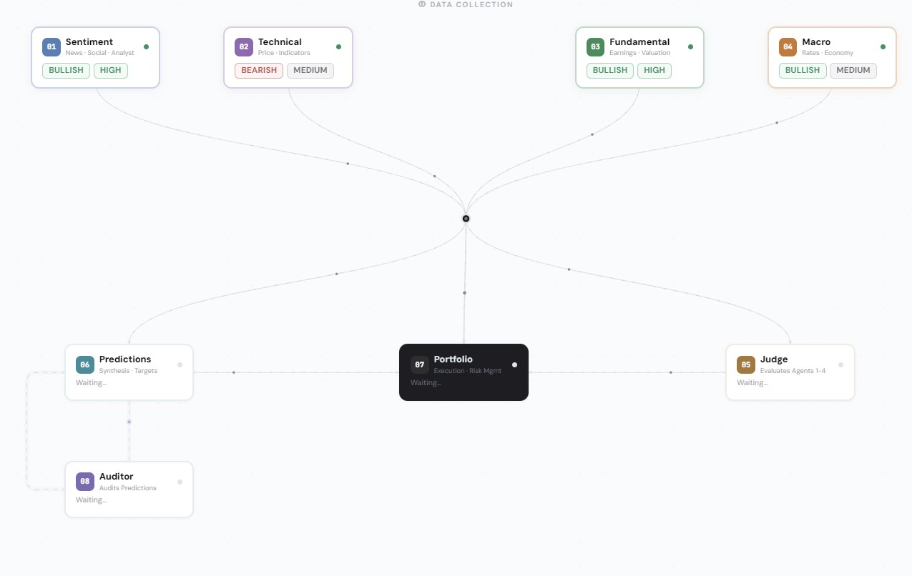

# Autonomous Multi-Agent System


**A multi-agent system that analyzes stocks, generates predictions, self-corrects over time, and manages a real portfolio in a fully autonomous way.**

## Live Demo
[Dashboard link](https://multi-agent-system-three.vercel.app/)
## Overview

Autonomous Multi-Agent System is a pipeline of 8 specialized AI agents built on Claude. Each agent has a precise responsibility, operates on a specific subset of data, and its work is evaluated by the other agents in the system.

This is not a high-frequency trading system or short-term speculation tool. It is a **structured observation system** with a long-term view. The portfolio is a measuring instrument: every decision produces a real P&L, every prediction is compared against a real price. The system cannot hide behind ambiguity.

The system is **hybrid by design**: precise numerical calculations are executed in Python, qualitative reasoning is delegated to Claude. Each agent does only what it is best suited for.


## Architecture

```
            AGENTIC FINANCE · Agent Architecture


        01 Sentiment ───┐
        02 Technical ───┤ Sonnet · independent analysis
        03 Fundamental ─┤
        04 Macro ───────┘
                        │
                        ▼
                 [ agent_outputs ]
                        │
              ┌─────────┴──────────┐
              │                    │
              ▼                    │
         05 Judge                  │
           Opus                    │
              │                    │
              │ quality            │
              │ reliability        │
              │                    ▼
              │
              └───────────► 06 Synthesis & Predictions ◄──┐
                                   Opus                   │
                                    │                     │
                                    ├──► predictions      │
                                    │    (1w · 1m · 1q)   │
                                    │                     │
                                    ▼                     │
                               08 Auditor                 │
                                 Sonnet                   │
                                    │                     │
                                    ├──► bias             │
                                    ├──► accuracy         │
                                    ├──► calibration      │
                                    │                     │
                                    └─── self-correct ────┘
                                          (next run)


          ┌──────────────────────────────────────────┐
          │                                          │
          │         07 Portfolio Manager             │
          │               Opus                       │
          │                                          │
          │  final observer                          │
          │  reads EVERYTHING from DB:               │
          │                                          │
          │  agent_outputs ◄── agents 1-4            │
          │  judge_evaluations ◄── agent 05          │
          │  predictions ◄── agent 06                │
          │  trades + portfolio_status ◄── history   │
          │                                          │
          │  $500k · max 5%/ticker                   │
          │                                          │
          │         ┌────────┼────────┐              │
          │         ▼        ▼        ▼              │
          │      trades  decisions  skips            │
          │     BUY/SELL    HOLD     SKIP            │
          │                                          │
          └──────────────────────────────────────────┘
```


## The Agents

**01 · Sentiment Analyst.** Reads recent news and price movements. Its job is to determine whether the market is reacting to real signals (an acquisition, a lawsuit, a product launch) or simple noise. Produces an outlook with reasoning anchored to the articles received.

**02 · Technical Analyst.** Analyzes price behavior exclusively: trend, momentum, position relative to the MA50 and MA200 moving averages, distance from the annual high and low. Does not read news or financial statements. Reasons only on what the market has done.

**03 · Fundamental Analyst.** Evaluates the company's financial health. Reads P/E, EPS, revenue, margins, and the most recent income statement. Answers a simple question: is the company worth what it costs?

**04 · Macro Analyst.** Looks at the broader economic context: Fed rates, inflation, unemployment, Treasury yields, consumer spending. Assesses whether the macroeconomic environment favors or penalizes that type of stock.

**05 · Judge.** Does not produce analysis. Reads the work of agents 1-4 and evaluates how well they reasoned across three dimensions: internal coherence, completeness relative to available data, and adherence to real data. An agent that produces generic and superficial analysis accumulates a low score and gradually loses weight in subsequent decisions.

**06 · Synthesis & Predictions.** The most complex agent. Receives all four analyses, the Judge's scores, and the Auditor's historical feedback on its own past errors. Weights each opinion by reliability and produces three concrete predictions: 1 week, 1 month, 1 quarter, each with outlook, price target, confidence level, and reasoning. If the Auditor has detected a systematic bias, it receives a direct warning and self-corrects.

**08 · Prediction Auditor.** Closes the loop. After every run it evaluates the predictions just produced. When historical data exists, it calculates in Python (not in Claude) mean error, systematic bias, confidence calibration, and accuracy trend over time. These numbers are passed to Claude to produce concrete feedback that the Synthesizer will read on the next run.

**07 · Portfolio Manager.** Final observer. Reads everything from the database (agent outputs, Judge scores, predictions, trade history) and makes a concrete decision for every open position: BUY, SELL, HOLD, or SKIP. Operates with fixed rules: $500k capital, maximum 5% per ticker, partial sell at +20% P&L, full sell at +30%.


## Daily Pipeline

```bash
python backend/daily.py 
```

| Step | Description |
|------|-------------|
| **1. Update Actuals** | Resolves all pending predictions by comparing them against real market prices |
| **2. Data Collection** | Collects data from Alpha Vantage: prices, news, fundamentals, income statement, macro |
| **2b. Data Gate** | Validates minimum data for each ticker. Blocks execution if price data is missing |
| **3. Agent Execution** | Runs agents in sequence: `01 → 02 → 03 → 04 → 05 → 06 → 08 → 07` |
| **4. Price Refresh** | Updates portfolio prices via Yahoo Finance. Free, 0 API calls |


## Database

The system uses **15 Supabase tables** organized in four domains:

**Market Data**
| Table | Content |
|-------|---------|
| `daily_prices` | Daily OHLCV prices per ticker |
| `news_sentiment` | Articles with sentiment score and relevance score |
| `fundamentals` | P/E, EPS, MA50, MA200, 52-week range |
| `income_statements` | Revenue, net income, EBITDA per period |
| `macro_data` | Macro indicators: Fed rate, CPI, Treasury, unemployment |

**Agent Output**
| Table | Content |
|-------|---------|
| `agent_outputs` | Analysis from agents 01-04: outlook, strength, reasoning |
| `judge_evaluations` | Judge ratings: coherence, completeness, data_adherence, overall |
| `agent_reliability` | Cumulative score per agent: score_avg, trend, runs |
| `predictions` | Predictions 1w/1m/1q: price_target, confidence, error_pct |
| `prediction_audits` | Auditor feedback: bias, accuracy_score, calibration |

**Portfolio**
| Table | Content |
|-------|---------|
| `trades` | Executed trades: BUY/SELL, shares, price, cash_remaining |
| `decisions` | Decision narratives with reasoning and bullets |
| `skips` | Tickers analyzed but not traded, with rationale |
| `portfolio_status` | Daily snapshot: total_value, cash, holdings, P&L |

**System**
| Table | Content |
|-------|---------|
| `collection_log` | Data collection frequency per ticker and type |


## The Three Feedback Loops

The system does not just run. It improves. Three loops operate autonomously on different time scales.

**Loop 1: Quality → Influence.**
After every run the Judge assigns a score to each agent. Scores accumulate into a reliability rating per agent per ticker. On the next run, the Synthesizer reads these ratings and weights opinions accordingly. An agent that reasons poorly gradually loses influence, without anyone modifying a single line of code.

**Loop 2: Prediction → Self-Correction.**
The Auditor evaluates every prediction produced by the Synthesizer and saves feedback in `prediction_audits`. On the next run the Synthesizer reads that feedback and receives direct warnings in its prompt:
```
⚠ SELF-CORRECT: Systematic BULLISH_BIAS detected on 1-WEEK horizon. Actively compensate.
⚠ SELF-CORRECT: Confidence calibration is poor. Prefer MEDIUM over HIGH.
```
These warnings are generated from statistics calculated in Python, not by Claude.

**Loop 3: Prediction → Reality.**
Every prediction is compared against the real market price at the horizon's expiration. The system calculates percentage error, aggregates accuracy statistics, and feeds them back into the audit. The system measures itself against reality over time.


## Tech Stack

**Models**
- **Sonnet**: agents 01, 02, 03, 04, 08. Constrained tasks with fixed-schema output. Fast and cost-effective.
- **Opus**: agents 05, 06, 07. Value judgments, multi-input synthesis, consequential decisions.

**Backend**
- **Python 3.10+**: pipeline, agents, data collection
- **Alpha Vantage**: prices, news, fundamentals, macro (25 calls/day, free tier)
- **Yahoo Finance**: portfolio price refresh, unlimited and free
- **Supabase**: cloud PostgreSQL database, 15 tables across four domains
- **BaseAgent**: shared base class with exponential backoff retry (5s→10s→20s), temperature 0.1, type-safe validators, per-call cost tracking

**Frontend**
- **React + Vite**: dashboard with custom SVG visualizations
- **Vercel**: frontend deploy
- **Supabase JS**: direct database connection

**Observability**
- File logging with rotation (5MB × 7 backups)
- Structured JSONL metrics (10MB × 12 backups)
- `python backend/diagnostic.py AAPL` for full system health check


## Cost Profile (approximate)

Costs vary based on input length and ticker complexity. The following values are rough estimates based on typical runs.

| Agent | Model | Estimated Cost / Run |
|-------|-------|----------------------|
| Agents 01-04 (×4) | Sonnet | ~$0.027 |
| Agent 05 Judge | Opus | ~$0.083 |
| Agent 06 Synthesis | Opus | ~$0.105 |
| Agent 08 Auditor | Sonnet | ~$0.011 |
| Agent 07 Portfolio | Opus | ~$0.065 |
| **Total** | | **~$0.29 / ticker / day** |


## Project Structure

```
agentic-finance/
├── .gitignore
├── .env.example
├── README.md
├── backend/
│   ├── daily.py                 # Entry point, full pipeline
│   ├── refresh_prices.py        # Standalone price refresh (Yahoo Finance)
│   ├── diagnostic.py            # System health panel
│   ├── logger.py                # Centralized logging + structured metrics
│   ├── requirements.txt
│   ├── agents/
│   │   ├── __init__.py
│   │   ├── base_agent.py        # Base class: API, validators, retry, costs
│   │   ├── fetch_data.py        # Centralized data retrieval
│   │   ├── agent_1_sentiment.py
│   │   ├── agent_2_technical.py
│   │   ├── agent_3_fundamental.py
│   │   ├── agent_4_macro.py
│   │   ├── agent_5_judge.py
│   │   ├── agent_6_synthesis.py
│   │   ├── agent_7_portfolio.py
│   │   └── agent_8_auditor.py
│   └── sql/
│       └── schema_clean.sql     # Supabase schema (15 tables)
└── frontend/
    ├── index.html
    ├── package.json
    ├── package-lock.json
    ├── vite.config.js
    ├── vercel.json
    └── src/
        ├── App.jsx
        ├── components.jsx
        ├── index.css
        ├── main.jsx
        └── lib/
            └── supabase.js      # Supabase client connection
```


## Setup

### Requirements
- Python 3.10+, Node.js 18+
- [Anthropic API key](https://console.anthropic.com)
- [Alpha Vantage API key](https://www.alphavantage.co/support/#api-key) (free tier)
- [Supabase](https://supabase.com) project

### Installation

```bash
# Backend
cd backend
pip install -r requirements.txt

# Frontend
cd frontend
npm install
npm run dev
```

### Configuration

```bash
cp .env.example backend/.env
cp .env.example frontend/.env
```

```
ANTHROPIC_API_KEY=your_key
ALPHA_VANTAGE_KEY=your_key
SUPABASE_URL=https://your-project.supabase.co
SUPABASE_KEY=your_service_role_key
```

Run `backend/sql/schema_clean.sql` in the Supabase SQL editor, then:

```bash
cd backend
python daily.py AAPL
```

### Useful Commands

```bash
python backend/daily.py AAPL MSFT      # Full pipeline for one or more tickers
python backend/diagnostic.py AAPL      # System health check
python backend/refresh_prices.py       # Update all portfolio prices (free)
```


## Roadmap

- **Automated backend deploy.** Bring the pipeline online with scheduled daily execution, removing the need to run `daily.py` manually.
- **Ticker scalability.** Support a larger number of tickers in parallel without exhausting available API calls.
- **Lossless synthesis.** Improve the Synthesizer prompt to handle scenarios with many inputs without degrading prediction quality.
- **Long-term testing.** Run the system in production for at least 6 months to observe the real behavior of feedback loops, bias stabilization, and prediction accuracy over time.
- **Per-run cost dashboard.** A panel showing tokens consumed, cost per agent, and total cost for each pipeline execution.
- **Agent performance panel.** A dedicated section for individual agent performance: Judge scores over time, reliability trends, cross-agent comparison per ticker.


## Notes

Building this system has solidified some intuitions and produced new ones.

The first is basic but gets ignored with a frequency that makes it anything but obvious: design before you code. A multi-agent system is not a collection of scripts, it is an architecture where every component depends on the outputs of others. If the structure is wrong, code cannot compensate. Having a clear schema before writing the first line, even a rough one, even on paper, prevents structural redesigns mid-project, the kind that cost weeks and create permanent technical debt.

The second concerns LLMs as evaluators. The financial domain simplifies this problem because it offers something rare: a measurable ground truth. Every prediction is compared against a real price. There is a number, there is a date, there is a calculable error. This makes it possible to build genuine feedback loops, where the Auditor measures and the Synthesizer corrects, because the evaluation criterion is objective. In domains where this ground truth does not exist (legal reasoning, ethical evaluation, creative production) a system of agents judging each other risks becoming circular: opinions validating opinions, with no anchor to reality. In those contexts, the human evaluator is not optional. It is a structural necessity.

The third is perhaps the most counterintuitive: more context does not mean more intelligence. Recent research confirms what is observed in practice. As context length increases, LLM reasoning quality degrades nonlinearly, with a particularly severe impact on tasks requiring multi-step logical chains. For those designing multi-agent systems the consequence is direct: adding agents, expanding prompts, accumulating context does not scale. A system with few agents, well-defined responsibilities, and focused prompts produces better results, and is faster, cheaper, and easier to debug, than a larger but disorganized system.


## License

MIT License. Free to use, modify, and distribute with attribution.
